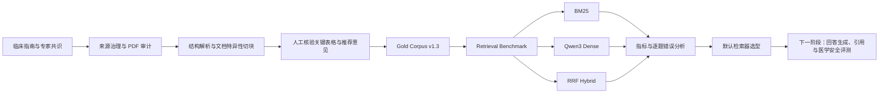

# 基于临床指南的膝痛与膝骨关节炎 RAG 问答及医学安全评测

**Guideline-Grounded RAG QA and Medical Safety Evaluation for Knee Pain and Knee Osteoarthritis**

> 从中文临床指南与专家共识出发，构建可审计的医学知识语料、检索评测集和多种检索基线，为后续带来源引用的问答生成与医学安全评测建立工程基础。

> 本项目目前处于**检索层完成、回答生成与安全评测待开发**阶段。项目用于研究和工程演示，不提供个人医疗建议，也不替代医生诊疗。

---

## 30 秒了解项目

这个项目重点解决三个问题：

1. **临床指南如何转化为可检索、可追溯的 RAG 知识块？**
2. **检索器找到的是否真的是回答问题所必需的医学证据？**
3. **BM25、Dense Embedding 和 Hybrid Retrieval 在中文医学问答中各有什么优势和失败模式？**

目前已完成：

- 中文膝骨关节炎指南与专家共识的文档审计、结构解析和人工核验；
- `Gold Corpus v1.3` 构建与冻结；
- 包含单证据、多证据、跨来源和不可回答问题的 Retrieval Pilot Benchmark；
- BM25、Qwen3 Dense 和 RRF Hybrid 三种检索方案；
- 按问题级别进行 Gold / Support 证据召回分析；
- 数据版权边界、版本冻结和可重复实验记录。

当前实验结果显示，**Qwen3 Dense Retrieval 是 Pilot 阶段表现最好的默认检索器**；BM25 与 RRF 作为对照与消融实验保留。

---

## 项目价值

这个项目不是简单地“把 PDF 放进向量数据库”，而是将医学知识库构建、证据标注和检索评测拆解为可审核的工程流程：

- 对指南来源、适用人群和文档质量进行治理；
- 对章节边界、推荐意见和关键表格进行人工复核；
- 区分回答必需的 **Gold Chunk** 与辅助性的 **Support Chunk**；
- 使用冻结后的 Benchmark 比较不同检索器；
- 保留负结果和失败案例，避免只展示最优指标；
- 明确公开仓库与本地受限语料之间的数据边界。

---

## 我的主要工作

- 定义项目范围：成人膝痛与膝骨关节炎；
- 筛选并审计中文临床指南和专家共识；
- 设计文档特异性的解析、清洗和 Chunk 规则；
- 对自动提取不稳定的关键表格进行人工转录与核验；
- 构建并审计 Gold Corpus；
- 设计 Retrieval Benchmark，并人工标注 Gold / Support 证据；
- 实现 BM25、Dense Embedding 和 RRF Hybrid 检索基线；
- 逐题分析词法匹配、语义偏移、否定表达和多证据召回问题；
- 设计版本冻结、哈希校验和公开仓库数据治理策略。

开发过程中使用 AI 辅助完成部分代码实现，但医学证据边界、评测规则、人工标注和结果审计均由人工完成并通过可重复脚本验证。

---

## 当前工程流程



---

## 数据与语料

### 当前正式索引来源

- `SRC001`：中国骨关节炎诊疗指南（2024）
- `SRC003`：中国膝骨关节炎临床药物治疗专家共识

其他候选资料保留在来源登记和解析实验中，但未进入当前正式索引。

### Gold Corpus

当前冻结版本：

```text
gold_v1_3
```

语料工程包括：

- 版面感知文本提取；
- 章节与标题层级人工核对；
- 文档特异性 Chunk 规则；
- 长推荐意见拆分；
- 关键症状、体征、诊断和影像表格人工核验；
- 稳定的 `chunk_id`、`source_id` 和标题路径元数据。

### 数据治理

由于指南版权和使用边界，公开仓库不包含：

- 原始指南 PDF；
- 完整指南正文；
- 本地 Gold Corpus 全文；
- 模型权重和 Embedding 缓存；
- 含完整检索文本的本地运行结果。

公开仓库保留：

- 构建与评测代码；
- 配置文件；
- 工程决策记录；
- 语料构建摘要和诊断结果；
- Benchmark 结构与冻结清单；
- 不包含完整指南正文的公开指标。

---

## Retrieval Benchmark

当前冻结的 Pilot Benchmark 包含：

| 类型 | 数量 |
|---|---:|
| 总问题数 | 12 |
| 可回答问题 | 11 |
| 不可回答问题 | 1 |
| 单证据问题 | 8 |
| 多证据问题 | 3 |
| 跨来源问题 | 1 |
| 无 Gold 问题 | 1 |

每个问题人工标注：

- `gold_chunk_ids`：回答不可缺少的核心证据；
- `supporting_chunk_ids`：可以补充回答、但不是核心必需证据；
- `expected_source_ids`：预期证据来源；
- `evidence_scope`：单 Chunk、多 Chunk 或无 Gold；
- `review_status`：人工审核状态。

Benchmark 在正式比较前经过逐题审计，并通过冻结文件和 SHA-256 清单防止后续根据模型结果反向修改标签。

---

## 检索实验结果

评测范围为冻结的 12 条 Pilot 问题，其中 11 条可回答问题参与主要检索指标计算。

| Retriever | Hit@1 | Hit@3 | Hit@5 | Recall@5 | MRR@10 |
|---|---:|---:|---:|---:|---:|
| BM25 | 72.7% | 81.8% | 81.8% | 74.2% | 78.6% |
| Qwen3 Dense | **81.8%** | **100.0%** | **100.0%** | **97.0%** | **89.4%** |
| BM25 + Dense RRF | 72.7% | 81.8% | 90.9% | 87.9% | 80.6% |

### 主要发现

- Dense 更擅长处理用户口语与指南术语不一致的问题；
- BM25 在专业关键词明确的查询中仍具有可解释性和稳定性；
- 等权 RRF 没有超过 Dense，部分问题反而受到 BM25 噪声影响；
- Hybrid Retrieval 并不天然优于最强的单一检索器；
- 当前 MVP 默认选择 `Qwen3-Embedding-0.6B` Dense Retrieval；
- BM25 和 RRF 保留为对照实验与失败分析证据。

### 代表性案例

- 用户表达“片子怎么看出来”，指南使用“影像学检查、X 线、MRI”等术语，Dense 能比 BM25 更早召回核心影像证据；
- 对“基础治疗包括哪些措施”的跨来源多证据问题，BM25 和 Dense 均能召回主要证据，但仍存在部分证据未进入 Top 5 的情况；
- RRF 在部分问题中将 Dense 已排在第 1 位的 Gold 证据向后移动，说明较弱检索器的噪声会影响融合结果。

> 这些指标仅用于验证工程管线和比较失败模式。Pilot 规模较小，每错 1 题会使 Hit 指标变化约 9.1 个百分点，因此不能将其解释为最终生产准确率。

---

## 技术实现

### 语料工程

- Python
- 版面感知 PDF 文本提取
- 文档特异性 Chunk 规则
- 人工表格证据核验
- CSV / JSONL 语料输出
- 版本化构建配置与诊断报告

### 检索

- 字符单字与双字级 BM25
- `Qwen/Qwen3-Embedding-0.6B`
- 1024 维归一化向量
- Apple Silicon MPS 本地推理
- 全量余弦相似度排序
- Reciprocal Rank Fusion
- Hit@K、Recall@K、MRR@10
- Gold-aware 与 Support-aware 分析

### 工程治理

- `uv` 依赖管理
- Git / GitHub 版本控制
- Benchmark 冻结与 SHA-256 校验
- 本地受限数据与公开工程证据分离
- `DECISIONS.md` 记录关键设计取舍

---

## 快速查看项目

建议按以下顺序阅读：

1. [`README.md`](README.md)：项目概览与主要结果；
2. [`DECISIONS.md`](DECISIONS.md)：关键工程决策和取舍；
3. [`docs/repository_guide.md`](docs/repository_guide.md)：目录和文件说明；
4. `docs/gold_corpus_v1_3_build_summary.csv`：Gold Corpus 构建摘要；
5. `docs/retrieval_benchmark_v1_frozen_manifest.csv`：Benchmark 冻结信息；
6. `docs/retrieval_bm25_dense_rrf_v1.csv`：三种检索器的逐题比较；
7. `docs/retrieval_*_metrics.csv`：各检索器总体指标。

---

## 本地运行

### 环境

- macOS / Apple Silicon
- Python 3.12
- `uv`

安装依赖：

```bash
uv sync
```

验证 Retrieval Benchmark：

```bash
uv run python \
  src/validate_retrieval_benchmark.py \
  --scope pilot
```

运行 BM25：

```bash
uv run python \
  src/run_bm25_baseline.py \
  --scope pilot
```

运行本地 Dense Retrieval：

```bash
HF_HUB_OFFLINE=1 \
uv run python \
  src/run_dense_baseline.py \
  --scope pilot
```

运行 RRF Hybrid：

```bash
uv run python \
  src/run_rrf_hybrid.py
```

生成三方比较：

```bash
uv run python \
  src/compare_retrieval_three_way.py
```

### 复现限制

公开仓库不提供原始指南、完整 Gold Corpus 和模型权重，因此外部访问者不能仅凭公开仓库从零重建全部结果。仓库重点展示：

- 可审计的方法；
- 代码和配置；
- 版本化实验流程；
- 公开安全的诊断与指标；
- 数据边界和工程决策。

---

## 当前状态与下一步

### 已完成

- [x] 数据源治理与文档审计
- [x] 指南解析与 Chunk 工程
- [x] Gold Corpus v1.3
- [x] Retrieval Pilot Benchmark
- [x] Benchmark 审计与冻结
- [x] BM25 检索基线
- [x] Qwen3 Dense 检索基线
- [x] RRF Hybrid 实验
- [x] 三方比较与默认检索器选型

### 待完成

- [ ] Dense Top-K 上下文组装
- [ ] 基于证据的回答生成
- [ ] Chunk 与指南来源引用
- [ ] 不可回答问题的拒答策略
- [ ] 医学安全评测
- [ ] 引用支持度和幻觉评测
- [ ] 扩展开发集与独立测试集
- [ ] 增加更多真实跨来源和复杂条件问题

---

## 当前结论

当前阶段已经完成了一个可审计的医学检索评测闭环：

```text
指南审计
→ 语料构建
→ Gold / Support 标注
→ Benchmark 冻结
→ BM25 / Dense / RRF 对比
→ 逐题错误分析
→ 默认检索器选型
```

下一阶段将以 Dense Retrieval 为默认入口，继续实现带证据引用的回答生成与医学安全评测。

---

## 免责声明

本项目仅用于技术研究、工程展示和评测方法探索，不构成医疗建议，不用于诊断或治疗决策。任何真实健康问题应咨询合格医疗专业人员。
